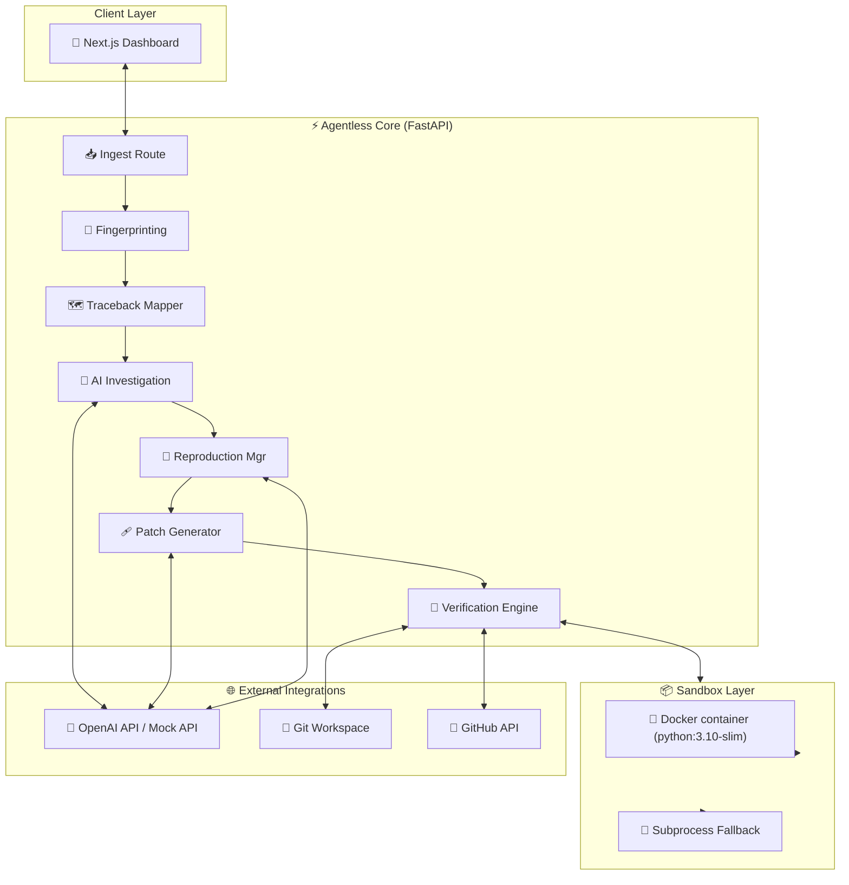

<div align="center">

# ⚡ AGENTLESS

### Autonomous API Debugging & Self-Healing

**From production failure → verified fix → GitHub Pull Request**

[](https://github.com/NITISH-027/agentless-api-observability)
[](https://github.com/NITISH-027/agentless-api-observability)
[](https://github.com/NITISH-027/agentless-api-observability)
[](https://github.com/NITISH-027/agentless-api-observability)
[](https://github.com/NITISH-027/agentless-api-observability)
[](https://github.com/NITISH-027/agentless-api-observability)

<br />

> Observability tells you that an API failed.  
> **Agentless investigates why, reproduces the failure in isolation, verifies a fix, and prepares the Pull Request.**

<p align="center">
  <a href="#-quick-start">🚀 Quick Start</a> •
  <a href="#-end-to-end-workflow">🔄 Workflow</a> •
  <a href="#-core-innovation--verification-first-ai-debugging">🧠 Core Innovation</a> •
  <a href="#-architecture">🏗️ Architecture</a> •
  <a href="#-end-to-end-demo">🎬 Demo</a> •
  <a href="#-technology-stack">🛠️ Stack</a> •
  <a href="#-testing">🧪 Testing</a> •
  <a href="#-safety--trust-model">🔐 Safety</a> •
  <a href="#-team-vulcan">👥 Team</a>
</p>

</div>

---

## 💡 One-Line Value Proposition

<div align="center">
🚨 <b>Detect</b> the failure &nbsp;→&nbsp; 📥 <b>Ingest</b> &nbsp;→&nbsp; 🧬 <b>Fingerprint</b> &nbsp;→&nbsp; 🗺️ <b>Map</b> traceback &nbsp;→&nbsp; 🧠 <b>Analyze</b> cause &nbsp;→&nbsp; 🧪 <b>Reproduce</b> &nbsp;→&nbsp; 🩹 <b>Patch</b> &nbsp;→&nbsp; 🔬 <b>Verify</b> &nbsp;→&nbsp; 🚀 <b>Open PR</b>
</div>

---

## 🚨 The Problem

API failures usually kick off a highly fragmented, manual, and developer-intensive debugging cycle:

```
🚨 API FAILURE ──> 📋 Inspect Logs ──> 🔎 Read Traceback ──> 🗺️ Find Source File
                                                                  │
                                                                  ▼
🔗 Open PR <── 🌿 Create Branch <── 🧪 Run Tests <── ✍️ Write Fix <── 🧠 Understand Root Cause <── 🧪 Reproduce Failure
```

Traditional observability tooling generally excels at detection, telemetry, logs, traces, and diagnostics. However, the subsequent repair workflow often remains completely developer-driven. Developers spend hours trying to check out the correct commit, reproduce the exact failure, propose safe fixes, and verify that the patch doesn't introduce regressions.

---

## ⚡ The Agentless Difference

| 🔍 Traditional Observability | ⚡ Agentless |
| :--- | :--- |
| **📊 Detects failures** | **📥 Ingests failure context** directly via REST endpoints |
| **📝 Shows logs** | **🧬 Fingerprints incidents** using stable hashing mechanisms |
| **🧵 Shows stack traces** | **🗺️ Maps tracebacks** directly to local workspace source lines |
| **📈 Provides diagnostics** | **🧠 Generates root-cause hypotheses** using LLM providers |
| **👨‍💻 Developer investigates** | **🧪 Generates reproduction** scripts and asserts the failure |
| **👨‍💻 Developer writes fix** | **🩹 Generates candidate patches** target-focused on the bug |
| **🧪 Developer validates** | **🔬 Automated verification** inside isolated Docker containers |
| **🔗 Developer creates PR** | **🚀 GitHub PR automation** with verified details and logs |

> **Traditional observability explains the incident. Agentless attempts to carry the incident through the repair workflow.**

---

## 🔄 End-to-End Workflow

The Agentless pipeline guides an ingested log automatically through execution and verification blocks:

```mermaid
flowchart LR
    A["🚨 API Failure"] --> B["📥 Ingest Log"]
    B --> C["🧬 Fingerprint & Scrub"]
    C --> D["🗺️ Traceback Mapping"]
    D --> E["🧠 AI Root-Cause"]
    E --> F["🧪 Reproduce Failure"]
    F --> G["🩹 Generate Patch"]
    G --> H["🔬 Sandbox Verify"]
    H --> I["🧪 Regression Tests"]
    I --> J["🚀 GitHub Branch & PR"]

    style A fill:#ff9999,stroke:#333,stroke-width:2px
    style J fill:#b3ffb3,stroke:#333,stroke-width:2px
```



---

## 🔥 Core Innovation — Verification-First AI Debugging

AI-generated code should not be trusted blindly. Agentless operates under a strict verification framework:

> 💡 **AI proposes. Execution proves.**

Instead of letting an LLM write code directly to production, Agentless treats the AI as a generator of *hypotheses*. Every patch must prove its validity by resolving a dynamically generated reproducer test without causing regressions or suppressing symptoms.

```
                  🧠 AI Generator
                         │
                         ▼
                 🩹 Candidate Patch
                         │
                         ▼
              🔬 Patch Validation Block
                         │
     ┌───────────────────┴───────────────────┐
     ▼                                       ▼
📦 Clean Workspace Check               🧪 Reproducer Run
     │                                       │
     ▼                                       ▼
🧪 Regression Testing                 🛡️ Suppression Filter
     │                                       │
     └───────────────────┬───────────────────┘
                         │
               ┌─────────┴─────────┐
               ▼                   ▼
           ❌ Reject            ✅ Accept
                                   │
                                   ▼
                            🚀 Pull Request
```

---

## 🧩 Inside the Pipeline

<details>
<summary>📥 <b>01 — Failure Ingestion</b></summary>

Accepts raw structured JSON payloads of application exceptions via `POST /logs` with zero SDK dependencies.
</details>

<details>
<summary>🧬 <b>02 — Incident Fingerprinting</b></summary>

Computes a stable SHA-256 fingerprint for incoming exceptions based on the HTTP method, normalized route path (scrubbing IDs/UUIDs), error type, and stack frame contexts to automatically deduplicate duplicates.
</details>

<details>
<summary>🛡️ <b>03 — Sensitive Data Scrubbing</b></summary>

Filters authorization tokens, API keys, cookies, and session headers to `[FILTERED]` case-insensitively before persistence.
</details>

<details>
<summary>🗺️ <b>04 — Traceback → Source Mapping</b></summary>

Parses tracebacks and maps relative stack frame file paths to target workspaces, locating the exact lines where the failure originated.
</details>

<details>
<summary>🧠 <b>05 — Root-Cause Investigation</b></summary>

Generates competing root-cause hypotheses based on stack traces, context files, and AST call graphs.
</details>

<details>
<summary>🧪 <b>06 — Failure Reproduction</b></summary>

Compiles the failure context into a targeted Pytest reproducer script asserting the original exception class.
</details>

<details>
<summary>🩹 <b>07 — Patch Generation</b></summary>

Generates the smallest, target-focused code diff (Unified Git Patch) designed to resolve the verified root cause.
</details>

<details>
<summary>🔬 <b>08 — Patch Verification</b></summary>

Clones a clean workspace, applies the patch, and executes the reproducer test inside an isolated Docker sandbox. The engine rejects patches that fail the test, timeout (detecting infinite loops), or attempt symptom suppression (e.g., swallowing exceptions with `except: pass`).
</details>

<details>
<summary>🚀 <b>09 — GitHub Automation</b></summary>

If verified, it creates a new branch (`ai-fix/incident-ID`), commits, pushes, opens a GitHub Pull Request with full analysis evidence, and adds labels `["ai-generated", "bug-fix", "verified"]`.
</details>

---

## 🎬 End-to-End Demo

Consider an order processing endpoint that crashes on invalid input:

```http
POST /orders
Content-Type: application/json

{
  "product_id": 101,
  "quantity": -1
}
```

### Before
```response
🚨 HTTP 500 Internal Server Error
ValueError: quantity cannot be negative
```
*The unhandled `ValueError` crashes the API.*

### Agentless Workflow In Action
1. **Ingest & Fingerprint**: Logs `ValueError` at `app/orders.py:3`.
2. **Reproduce**: Generates a Pytest script verifying that sending a negative quantity triggers the unhandled error.
3. **Patch**: Generates a unified patch to catch negative inputs and return `HTTPException(400)`.
4. **Verify**: Runs the reproducer against the patched code inside the sandbox.

### After
```response
✅ HTTP 400 Bad Request
{
  "detail": "quantity cannot be negative"
}
```

### Verification Execution Report
| Verification Stage | Result | Details |
| :--- | :--- | :--- |
| **📥 Patch Endpoint** | ✅ Passed | Patch successfully parsed |
| **📦 Clean Workspace** | ✅ Passed | Isolated clone checked out |
| **🔎 Patch Validation** | ✅ Passed | Syntactically correct diff |
| **🩹 Patch Application** | ✅ Passed | Clean `git apply` without conflicts |
| **🧪 Reproducer Execution** | ✅ Passed | Test ran inside sandbox container |
| **🧪 Regression Testing** | ✅ Passed | Existing project tests continue to pass |
| **🌿 Branch Creation** | ✅ Passed | Branch `ai-fix/incident-inc_...` created |
| **📤 Git Push** | ✅ Passed | Changes pushed to origin |
| **🔗 Pull Request** | ✅ Passed | PR opened on GitHub |

---

## 🏗️ Architecture



---

## 🛠️ Technology Stack

| Layer | Technology | Purpose |
| :--- | :--- | :--- |
| **🎨 Frontend** | **Next.js 16 + React 19 + TS** | Dashboard UI and interactive control center |
| **⚡ Backend** | **FastAPI + Python 3.10+** | High-performance async core API & pipelines |
| **🧠 AI / LLM** | **OpenAI (`gpt-4o-mini`) / Mock** | Incident analysis, reproducer & patch generation |
| **🗄️ Database** | **SQLite + SQLAlchemy** | Persistence for Incidents, Hypotheses & Logs |
| **🐳 Sandbox** | **Docker (`python:3.10-slim`)** | Isolated environments for running reproducer scripts |
| **🐙 Version Control** | **Git** | Automated patch branches and git actions |
| **🚀 Integration** | **GitHub REST API** | Creating pull requests and managing issues/labels |
| **🧪 Testing** | **Pytest** | Running local verification test suites |

---

## 📁 Project Structure

```
agentless/
├── ⚡ backend/                 # FastAPI Backend Codebase
│   ├── app/
│   │   ├── api/routes/        # health, logs, and github API routes
│   │   ├── core/              # config, database connection, and logging
│   │   ├── models/            # SQLAlchemy DB entities
│   │   ├── schemas/           # Pydantic schemas for request validations
│   │   └── services/          # Core Business Logic services
│   │       ├── analysis/      # Traceback mapping, LLM providers, and AST parser
│   │       ├── github/        # Git client, workspace clones, and PR manager
│   │       ├── ingestion/     # Scrubbers & fingerprinting
│   │       ├── patch/         # Patch generators
│   │       └── reproduction/  # Sandbox executors & reproducer managers
│   └── tests/                 # 63 backend tests covering core functionality
├── 🎨 frontend/                # Next.js Dashboard App Router
│   ├── app/                   # Dashboard Page routes
│   ├── components/            # Interactive dashboard UI components
│   └── lib/                   # API Client communication utility
├── 🧪 sandbox/                 # Sandbox and environment setup helpers
├── 📜 scripts/                 # Developer start & verification tools
├── 📖 README.md               # Visual Platform Guide (this file)
└── 🔐 .env.example             # Base configuration details
```

---

## 🚀 Quick Start

### Prerequisites
* **Python 3.10+**
* **Node.js 18+** and **npm**
* **Docker** (Optional, falls back to local subprocess sandbox run if absent)

### 01 — Clone and Environment Setup
Clone the repository and copy the environment template:
```bash
git clone https://github.com/NITISH-027/agentless-api-observability.git
cd agentless-api-observability
cp .env.example .env
```
Update `.env` with your OpenAI API keys and GitHub tokens.

### 02 — Backend Service
Initialize the virtual environment, install requirements, and run the FastAPI server:
```bash
cd backend
python -m venv .venv
# On Windows (PowerShell):
.venv\Scripts\Activate.ps1
# On Linux/macOS:
source .venv/bin/activate

pip install -r requirements.txt
uvicorn app.main:app --reload --port 8000
```
Backend Swagger docs will be available at [http://127.0.0.1:8000/docs](http://127.0.0.1:8000/docs).

### 03 — Frontend Dashboard
Install Node dependencies and start the development server:
```bash
cd ../frontend
npm install
npm run dev
```
Open [http://localhost:3000](http://localhost:3000) to view the interactive dashboard.

---

## 🎭 AI Provider Modes

Agentless supports two execution modes for flexible testing and production runs:

| 🎭 Mode | Provider Config | Description |
| :--- | :--- | :--- |
| **Mock Mode** | `LLM_PROVIDER=mock` | Deterministic responses used for local demos, quick testing, and offline hackathon showcases without consuming API keys. |
| **Live AI Mode** | `LLM_PROVIDER=openai` | Uses `gpt-4o-mini` with your configured `LLM_API_KEY` to run actual AST-based analysis and code patch generations. |

---

## 🔐 Safety & Trust Model

Autonomous code execution requires safety boundaries. Agentless implements security safeguards:

* **🛡️ Sensitive Data Scrubbing**: High-entropy tokens, passwords, session cookies, and authentication headers are stripped before saving.
* **📦 Workspace Isolation**: Git checkouts are cloned into separate, short-lived paths inside `/workspace` and deleted immediately after verification.
* **🐳 Sandbox Isolation**: Patched code and tests execute inside isolated Docker containers to prevent malicious runtime damage.
* **🔎 Patch Validation**: Programmatic AST and regex checks block patches attempting symptom suppression or generic exception swallowing.
* **👨‍💻 Human Review Gate**: Pull requests are proposed as branches with clear labels (`ai-generated`) allowing developer audit before final merging.

---

## 🧪 Testing

The codebase includes a fully-featured integration and unit testing suite.

```bash
cd backend
.venv\Scripts\pytest
```

#### Test Execution Result
* **Total Tests**: **63 Items**
* **Result**: **63 Passed**
* **Coverage**: AST analyzer, configurations, GitHub clients, ingestion scrubbers, patch validators, reproducer sandboxes, and verification systems.

---

## 📈 MVP Status

| Pipeline Capability | Status |
| :--- | :--- |
| **📥 Failure Ingestion** | ✅ Completed |
| **🧬 Fingerprinting** | ✅ Completed |
| **🛡️ Data Scrubbing** | ✅ Completed |
| **🗺️ Traceback Mapping** | ✅ Completed |
| **🧠 AI Investigation** | ✅ Completed |
| **🧪 Failure Reproduction** | ✅ Completed |
| **🩹 Patch Generation** | ✅ Completed |
| **🔬 Isolated Sandbox Verification** | ✅ Completed |
| **🧪 Regression Testing** | ✅ Completed |
| **🌿 Git Branch Automation** | ✅ Completed |
| **🚀 GitHub PR Creation** | ✅ Completed |
| **🎨 Next.js Dashboard UI** | ✅ Completed |

---

## 🏆 Why Agentless Matters

Traditional AI software agents are often complex, hard to configure, and can behave unpredictably. Agentless introduces a lightweight, robust alternative:

* **Zero SDK/Agent Footprint**: Integrates cleanly into any existing logging stack via standard API payloads.
* **Execution Proves All**: Bypasses the uncertainty of LLM code generation by forcing code verification through isolated tests.
* **Developer Centric**: Fits seamlessly into standard GitHub workflows with descriptive, clear PRs that reduce developer triage time.

---

## 👥 Team VULCAN

<div align="center">

### 🏆 VULCAN
**Panimalar Engineering College**  
📍 Chennai, India

| 👤 Member | 🎯 Focus |
| :--- | :--- |
| **Nitish P** | 🧠 AI Architecture & Backend Engineering |
| **Niranjan B** | ⚙️ Core Systems Integration & Pipelines |
| **Neal Patrick A** | 🎨 Frontend Engineering & Dashboard UI |

</div>

---

<div align="center">

**⚡ VULCAN × AGENTLESS**  
*From production failure to verified Pull Request.*

**Built for PEC Hacks 4.0**

<br />

🧠 **AI Proposes.** &nbsp;&nbsp;•&nbsp;&nbsp; 🔬 **Execution Proves.**

</div>
